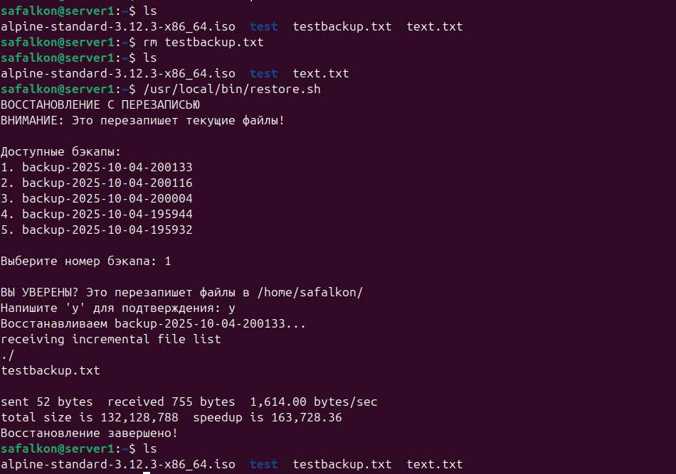

# Домашнее задание к занятию "`Резервное копирование`" - `Сафронов Алексей`

---

### Задание 1

---

### Задание 2

  
[crontab](./safalkon)  
[script](./backup_script.sh)

---

### Задание 3

---

### Задание 4

  
[backup](./backup.sh)
[restore](./restore.sh)

---
